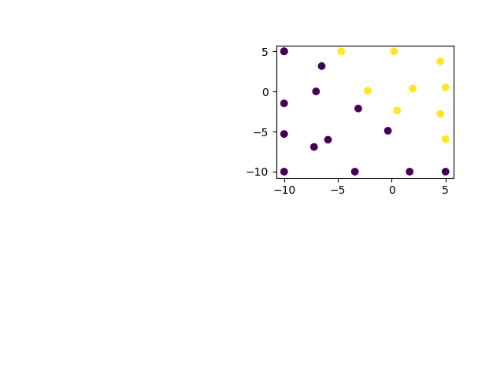

# Bayesian Safety Validation
A Python implementation of bayesian safety validation.

## Usage
```pyhton
from bayesian_safety_validation import BayesianSafetyValidation

# Define a black box function
def black_box_func(params) -> float:
    return float(
        (
            (params["x1"] + 2 * params["x2"] - 7) ** 2
            + (2 * params["x1"] + params["x2"] - 5) ** 2
        )
        <= 200
    )

# Create BSV with a parameter space
bsv = BayesianSafetyValidation(param_space={"x1": (-10, 5), "x2": (-10, 5)})

# Run BSV loop.
for i in range(10):
    suggestions = bsv.suggest()
    evaluations = [black_box_func(suggestion) for suggestion in suggestions]
    print(f"suggestions: {suggestions}, evaluations: {evaluations}")
    bsv.refit(suggestions, evaluations)

# Display results
bsv.falsification()
```
You will get this graph after running forementioned code

